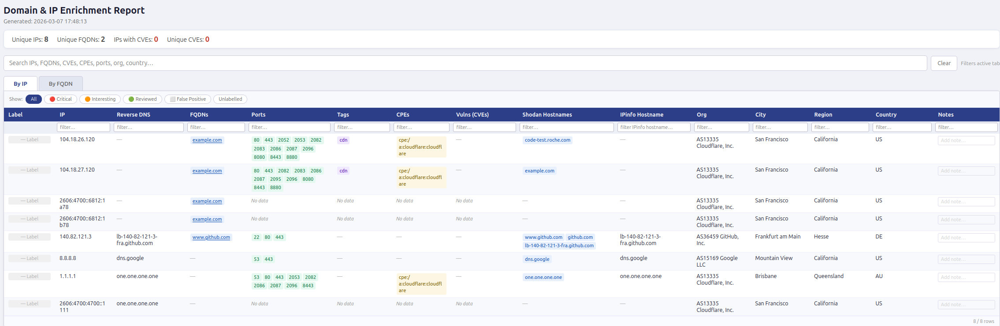

# d2i.py — Domain to IP Enrichment Tool

Accepts a mixed input file of domains, subdomains, URLs, and raw IPs. Resolves each to its IP address(es), enriches the results with geolocation and organisation data via [IPinfo.io](https://ipinfo.io) and open port/vulnerability data via [Shodan InternetDB](https://internetdb.shodan.io), then generates a self-contained HTML report.



## Features

- Mixed input: domains, subdomains, full URLs, raw IPv4/IPv6 addresses in one file
- Comments (`#`) and blank lines are ignored
- Optional IPv6 resolution (`-v6`)
- Reverse DNS lookup per IP
- **CNAME chain resolution** — follows and records the full CNAME chain for each domain (requires `dnspython`); long chains are displayed compactly with a hover tooltip showing the full path
- Enrichment via IPinfo.io (hostname, org, city, region, country) — API key optional; report still generates without one
- Enrichment via Shodan InternetDB — free, no API key needed (ports, tags, CPEs, CVEs, hostnames)
- Private, reserved, and IPv6 addresses are automatically skipped for Shodan (not supported by InternetDB)
- Two-tab HTML report: **By IP** and **By FQDN**
- Global search (debounced), per-column filters, and sortable columns
  - Array columns (Ports, CVEs, CPEs, Tags) sort by **count**; Ports additionally tiebreak by lowest port number
- Clickable FQDNs and IPs that cross-link between tabs
- **CVE IDs are clickable links** — each badge opens the NVD entry directly in a new tab
- Per-row severity labels (Critical / Interesting / Reviewed / False Positive) and free-text notes — persisted in browser `localStorage` across page refreshes (up to 5 most-recent reports retained automatically)
- Progress output goes to `stderr`; the report path is printed to `stdout` for easy piping
- Fully self-contained output (single `.html` file, no CDN or internet connection required to view)

---

## Requirements

- Python 3.9+
- An [IPinfo.io](https://ipinfo.io) API token (free tier available; optional but recommended)

Python dependencies:

| Package | Required | Purpose |
|---|---|---|
| `validators` | Yes | Domain and URL validation |
| `tldextract` | Yes | FQDN extraction from URLs |
| `ipinfo` | Yes | IPinfo.io API client |
| `requests` | Yes | Shodan InternetDB HTTP calls |
| `dnspython` | Optional | CNAME chain resolution |

Without `dnspython` the CNAME Chain column will be empty and a warning banner is shown in the report.

---

## Installation

### Option A — Run directly with `uv` (recommended, no virtual environment needed)

[`uv`](https://github.com/astral-sh/uv) installs dependencies on the fly. No setup required.

```bash
uv run --with validators --with tldextract --with ipinfo --with requests --with dnspython \
    d2i.py -f input.txt --ipinfo_token YOUR_TOKEN
```

Without CNAME resolution (omit `--with dnspython` if not needed):

```bash
uv run --with validators --with tldextract --with ipinfo --with requests \
    d2i.py -f input.txt --ipinfo_token YOUR_TOKEN
```

### Option B — Virtual environment

```bash
# Create and activate a virtual environment
python3 -m venv .venv
source .venv/bin/activate        # Linux / macOS
# .venv\Scripts\activate         # Windows

# Install dependencies
pip install validators tldextract ipinfo requests dnspython

# Run
python d2i.py -f input.txt --ipinfo_token YOUR_TOKEN
```

---

## IPinfo API Token

The script uses [IPinfo.io](https://ipinfo.io) to look up hostname, organisation, city, region, and country for each IP. A free account provides up to 50,000 requests/month.

The token can be supplied in two ways:

```bash
# As a CLI argument
python d2i.py -f input.txt --ipinfo_token YOUR_TOKEN

# As an environment variable
export IPINFO_TOKEN=YOUR_TOKEN
python d2i.py -f input.txt
```

If no token is provided the IP detail columns will show `—` but the rest of the report still generates.

---

## Input File Format

One entry per line. Supported formats:

| Format | Example |
|---|---|
| Plain domain | `example.com` |
| Subdomain | `sub.example.com` |
| Full URL | `https://www.example.com/some/path` |
| Raw IPv4 | `8.8.8.8` |
| Raw IPv6 | `2606:4700:4700::1111` |
| Comment | `# this line is ignored` |
| Blank line | _(ignored)_ |

See `test_input.txt` for a ready-to-use example:

```
# Test input file
# Domains / subdomains
example.com
sub.example.com
https://www.github.com/some/path

# Raw IPs
8.8.8.8
1.1.1.1

# IPv6
2606:4700:4700::1111
```

---

## Usage

```
python d2i.py -f INPUT_FILE [--ipinfo_token TOKEN] [-v6]
```

| Argument | Description |
|---|---|
| `-f`, `--file` | Path to the input file (required) |
| `--ipinfo_token` | IPinfo.io API token (or set `IPINFO_TOKEN` env var) |
| `-v6`, `--version6` | Also resolve IPv6 addresses |

### Examples

```bash
# Basic run
python d2i.py -f test_input.txt --ipinfo_token YOUR_TOKEN

# With uv, full feature set including CNAME resolution and IPv6
uv run --with validators --with tldextract --with ipinfo --with requests --with dnspython \
    d2i.py -f test_input.txt --ipinfo_token YOUR_TOKEN -v6

# Using an environment variable for the token
export IPINFO_TOKEN=YOUR_TOKEN
python d2i.py -f targets.txt

# Open the report automatically after generation (macOS)
python d2i.py -f targets.txt --ipinfo_token YOUR_TOKEN | xargs open

# Open the report automatically after generation (Linux)
python d2i.py -f targets.txt --ipinfo_token YOUR_TOKEN | xargs xdg-open

# Capture the report path
REPORT=$(python d2i.py -f targets.txt --ipinfo_token YOUR_TOKEN)
echo "Report saved to: $REPORT"
```

The report path is printed to `stdout` on completion; all progress output goes to `stderr`.

---

## Output

Reports are saved to the `results/` directory (created automatically) with a timestamped filename:

```
results/report_2026-03-07_14-04-48.html
```

Open the file in any modern browser.

### Report tabs

**By IP** — one row per unique IP address:

| Column | Description |
|---|---|
| Label | Severity label (click to cycle) |
| IP | Resolved IP address |
| Reverse DNS | PTR record result |
| FQDNs | Input domains that resolved to this IP (clickable → By FQDN tab) |
| CNAME Chain | Full resolution path, e.g. `domain.com → …(3 hops) → 1.2.3.4` — hover for full chain |
| Ports | Open ports from Shodan InternetDB |
| Tags | Shodan tags (e.g. `cloud`, `cdn`) |
| CPEs | Common Platform Enumeration strings |
| Vulns (CVEs) | CVE IDs — each is a clickable link to the NVD entry |
| Shodan Hostnames | Hostnames returned by Shodan |
| IPinfo Hostname | Hostname from IPinfo.io |
| Org | Organisation from IPinfo.io |
| City / Region / Country | Geolocation from IPinfo.io |
| Notes | Free-text analyst note |

**By FQDN** — one row per unique input domain:

| Column | Description |
|---|---|
| Label | Severity label (click to cycle) |
| FQDN | Input domain/subdomain |
| CNAME Chain | Full resolution path with hop count and hover tooltip |
| IPs | Resolved IP addresses (clickable → By IP tab) |
| Reverse DNS | PTR records for associated IPs |
| Shodan Hostnames | Hostnames returned by Shodan |
| Ports | Aggregated open ports across all IPs |
| Vulns (CVEs) | Aggregated CVEs — clickable NVD links |
| Org | Organisation(s) from IPinfo.io |
| Country | Country/countries from IPinfo.io |
| Notes | Free-text analyst note |

### CNAME Chain display

For domains with a CNAME chain, the chain is shown compactly:

- **Short chains (≤ 3 hops):** displayed inline: `domain.com → alias.net → 1.2.3.4`
- **Long chains (4+ hops):** truncated with hop count: `domain.com → …(4 hops) → 1.2.3.4`
  - Hover over the cell to see the full chain in a tooltip (indicated by a dashed underline)
- Domains with no CNAME (direct A record) show `—`

If `dnspython` is not installed, all CNAME Chain cells show `—` and a warning banner appears at the top of the report.

### Severity labels

Click the **Label** button on any row to cycle through severity states:

| Label | Use for |
|---|---|
| — | Not yet triaged |
| 🔴 Critical | Confirmed high-priority finding |
| 🟠 Interesting | Worth investigating further |
| 🟢 Reviewed | Checked and understood |
| ⬜ False Positive | Can be ignored |

Labels and notes are saved in the browser's `localStorage` and survive page refresh. The five most recent reports' labels and notes are retained; older data is pruned automatically.

---

## Rate limiting

Shodan InternetDB enforces approximately 1 request/second. The script automatically sleeps 1.1 seconds between Shodan queries. Private/reserved IPs and IPv6 addresses are skipped entirely (InternetDB only covers public IPv4), so only public IPv4 addresses count toward the delay. For large input files, expect roughly 1 second per unique public IPv4 address in enrichment time.

---

## Startup log

On each run the script prints a summary to `stderr` showing which features are active:

```
======># Starting D2I #<=======
Input file : targets.txt
IPv6       : disabled
IPinfo     : token provided
CNAME res  : enabled (dnspython)
================================
```

If `dnspython` is missing the CNAME line reads:

```
CNAME res  : DISABLED — install dnspython (add --with dnspython to uv run)
```
